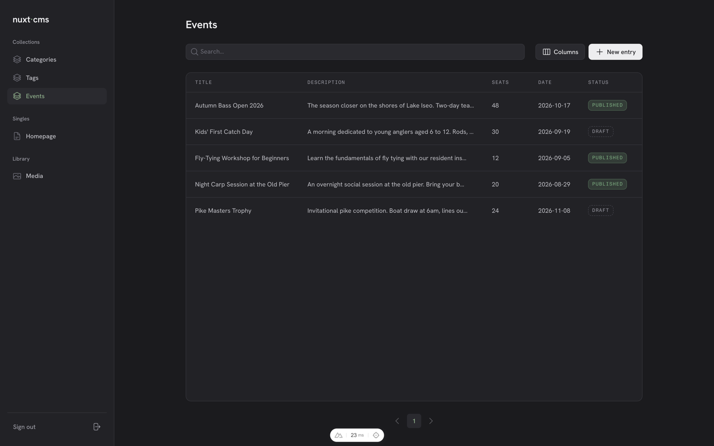
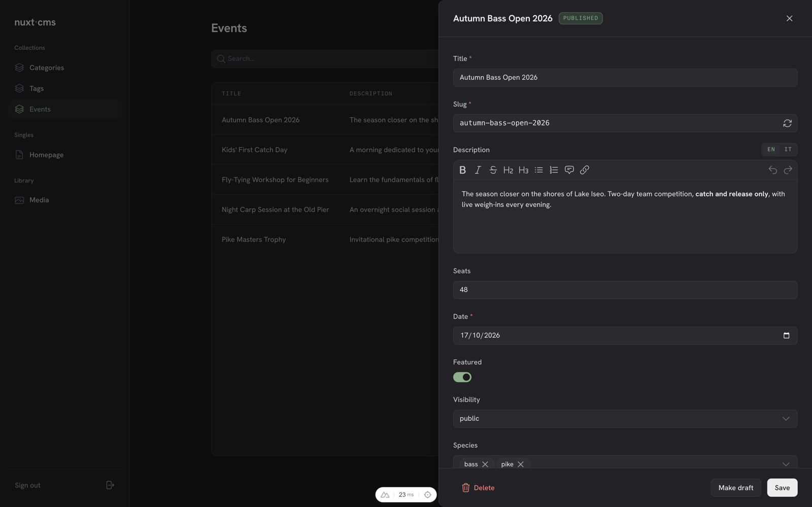
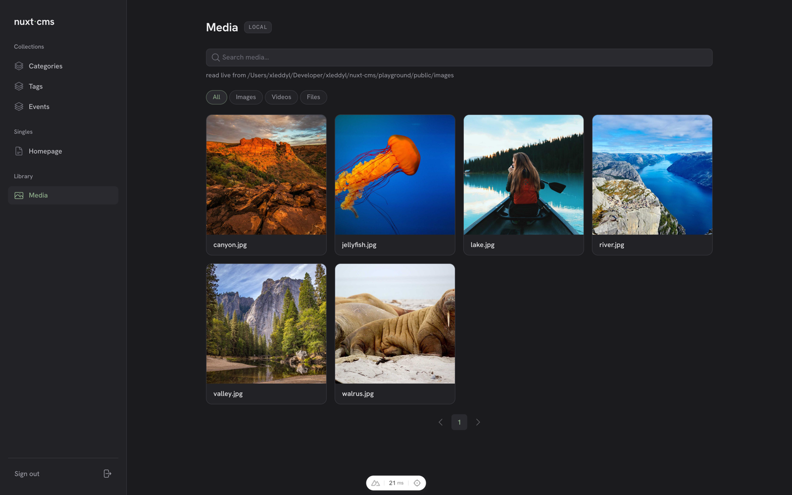

# nuxt-cms

[](https://www.npmjs.com/package/@xleddyl/nuxt-cms)
[](https://github.com/xleddyl/nuxt-cms/actions/workflows/ci.yml)
[](LICENSE)

nuxt-cms is a Nuxt module that leverages the Nitro server to ship a lightweight CMS together with your Nuxt frontend, no external CMS, no second service to deploy, nothing extra to pay for. Content lives next to the code that renders it: you define content types in code, editors manage entries from a built-in admin panel, and the same server that serves your site serves your content.

- **Zero extra infrastructure**: the CMS runs inside your app's Nitro server; you deploy one thing.
- **Content types in code**: a `cms.config.ts` with `defineCmsConfig()` declares collections, single documents, relations, blocks and translatable fields; database schema, migrations and TypeScript types are generated from it.
- **Admin panel at `/cms`**: entry editing with validation, drafts, media library (S3-compatible storage, or a local mode backed directly by your `public/` folder), single-admin auth from env credentials.
- **Public GraphQL API**: read-only, typed end-to-end via gql.tada, with filtering, sorting and pagination; fields marked `private` stay out of it.
- **SQLite, Postgres, libSQL/Turso or Cloudflare D1**: a local file database by default, one config line to switch (including remote SQLite over the network).
- **Runs on serverless too**: migrations are baked into the server bundle, uploads are presigned straight to your bucket, sessions are sealed cookies. Nothing on the request path needs a local disk or sticky instances.

## Screenshots







## Installation

```bash
npm install @xleddyl/nuxt-cms
```

Register the module and configure it under the `cms` key in `nuxt.config.ts`:

```ts
export default defineNuxtConfig({
   modules: ['@xleddyl/nuxt-cms'],
   cms: {
      i18n: {
         locales: ['en', 'it'],
         defaultLocale: 'en',
      },
   },
})
```

`database` defaults to SQLite (`{ driver: 'sqlite', path: 'data/cms.db' }`) and can be omitted
entirely. Switch it to `{ driver: 'postgres', url: '...' }`,
`{ driver: 'libsql', url: '...', authToken: '...' }` (Turso/remote) or
`{ driver: 'd1', binding: 'DB' }` (Cloudflare Workers); see
[Configuration](docs/configuration.md) for every option and
[Deployment](docs/deployment.md) for which driver each host supports.

Each driver brings its own client, and only the one you use has to be installed: SQLite works out of
the box, `postgres` needs `pg`, `libsql` needs `@libsql/client`, and `d1` needs nothing extra. The
build stops with an explicit message if the client for the configured driver is missing.

Then declare your content types in a `cms.config.ts` at the project root with `defineCmsConfig()`.

### Disabling the CMS

Keep the module in `modules[]` at all times and turn it off with the `enabled` option or the
`NUXT_CMS_ENABLED` env var. When disabled the module registers no-op `useCms` / `$cmsQuery` stubs and
nothing else, so components can call them unconditionally and simply render their empty states:

```ts
export default defineNuxtConfig({
   modules: ['@xleddyl/nuxt-cms'],
   cms: { enabled: false },
})
```

See [Configuration](docs/configuration.md#enabled) for the resolution order.

### Environment variables

Every secret maps to runtime config, so it can be set as an env var instead of in `nuxt.config.ts`:

| Variable | Required | Purpose |
| --- | --- | --- |
| `NUXT_CMS_ENABLED` | no | set to `0` / `false` to disable the CMS (default enabled) |
| `NUXT_CMS_ADMIN_EMAIL` | yes | admin login email |
| `NUXT_CMS_ADMIN_PASSWORD` | yes | admin login password |
| `NUXT_SESSION_PASSWORD` | in production | session encryption key (32+ chars) |
| `NUXT_CMS_DATABASE_URL` | with `postgres` / remote `libsql` | Postgres connection string or libSQL URL |
| `NUXT_CMS_DATABASE_AUTH_TOKEN` | with remote `libsql` | libSQL/Turso auth token |
| `NUXT_CMS_MIGRATE_ON_BOOT` | no | `false` to apply migrations in CI instead of on boot |
| `NUXT_CMS_MEDIA_ENDPOINT` | for media | S3-compatible endpoint |
| `NUXT_CMS_MEDIA_REGION` | for media | S3 region (default `auto`) |
| `NUXT_CMS_MEDIA_BUCKET` | for media | bucket name |
| `NUXT_CMS_MEDIA_ACCESS_KEY_ID` | for media | S3 access key id |
| `NUXT_CMS_MEDIA_SECRET_ACCESS_KEY` | for media | S3 secret access key |
| `NUXT_PUBLIC_CMS_MEDIA_BASE_URL` | for media | public base URL for uploaded files |

## Documentation

Full documentation lives in [`docs/`](docs/README.md):

- [Getting started](docs/getting-started.md) — install, configure, first content type, run.
- [Configuration](docs/configuration.md) — every `cms.*` option and the `NUXT_CMS_*` env vars.
- [Database](docs/database.md) — SQLite, Postgres, libSQL/Turso and D1 drivers, migrations, studio.
- [Schema](docs/schema.md) — `defineCmsConfig`, entries, field types, relations, blocks, i18n.
- [Querying content](docs/querying.md) — GraphQL API, `useCms` / `$cmsQuery`, filters, sorting, pagination.
- [Admin panel & security](docs/admin.md) — pages, authentication, sessions, admin REST API.
- [Media](docs/media.md) — S3-compatible storage or local mode backed by your `public/` folder, upload flow, allowed file types.
- [Deployment](docs/deployment.md) — host/driver matrix, migrations on serverless, horizontal scaling, Cloudflare Workers.

## LLM guide

[llm.txt](llm.txt) is a compact reference meant to be fed to an LLM: schema definition (`cms.config.ts`, field types, relations, blocks, i18n), the `useCms` / `$cmsQuery` composables and the generated GraphQL API (filters, sorting, pagination).

## Development

```bash
pnpm install
pnpm dev:prepare  # module stub + playground prepare (first time and after module.ts changes)
pnpm dev          # playground on http://localhost:3000 (generates + applies migrations on boot)
pnpm db:studio    # drizzle studio
```

## Configuration

All config lives under `cms` in `nuxt.config.ts` (see `ModuleOptions` in `src/module.ts`); secrets map to runtime config, so they can be provided as `NUXT_CMS_*` env vars instead (plus `NUXT_SESSION_PASSWORD` for sessions in production). `cms.database.driver: 'postgres'` switches driver, drizzle dialect and migration folder together; re-run `dev:prepare` after switching.

## License

[MIT](LICENSE)
