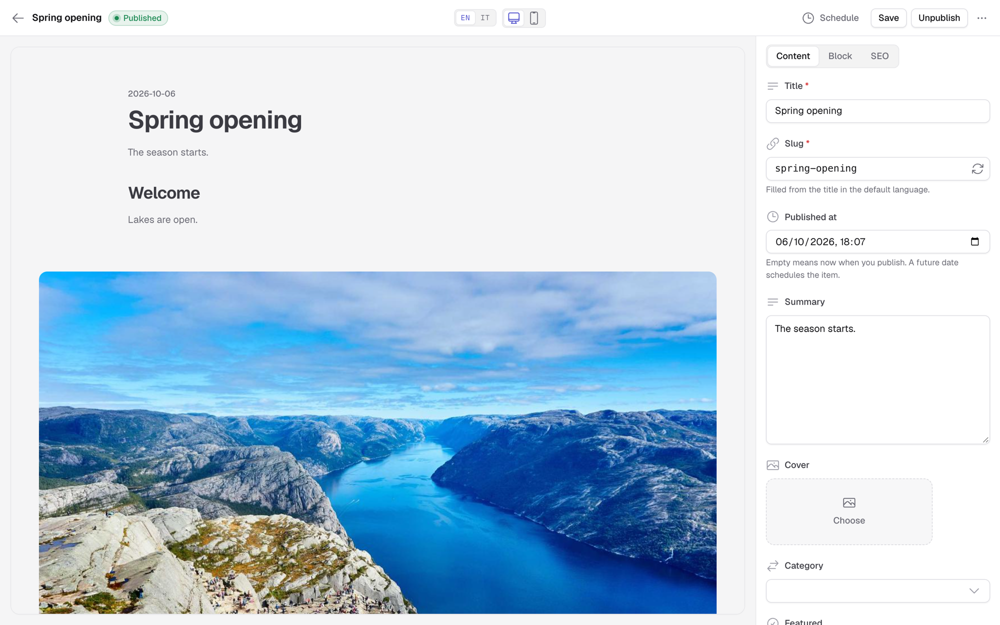
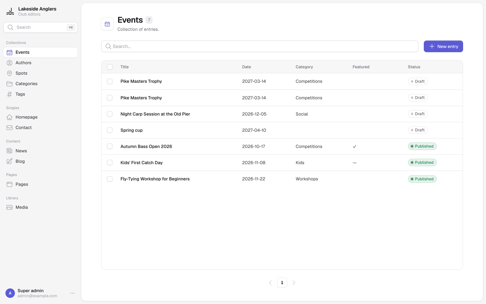
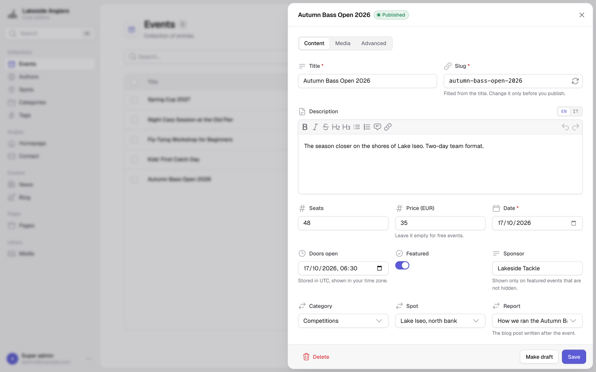
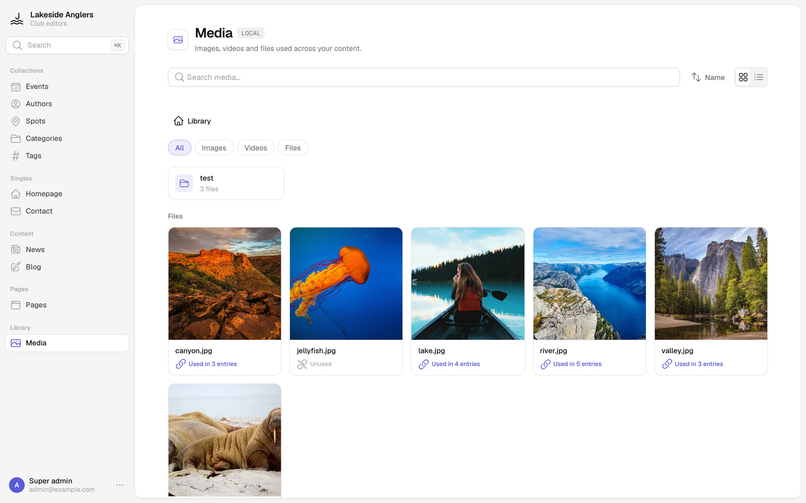
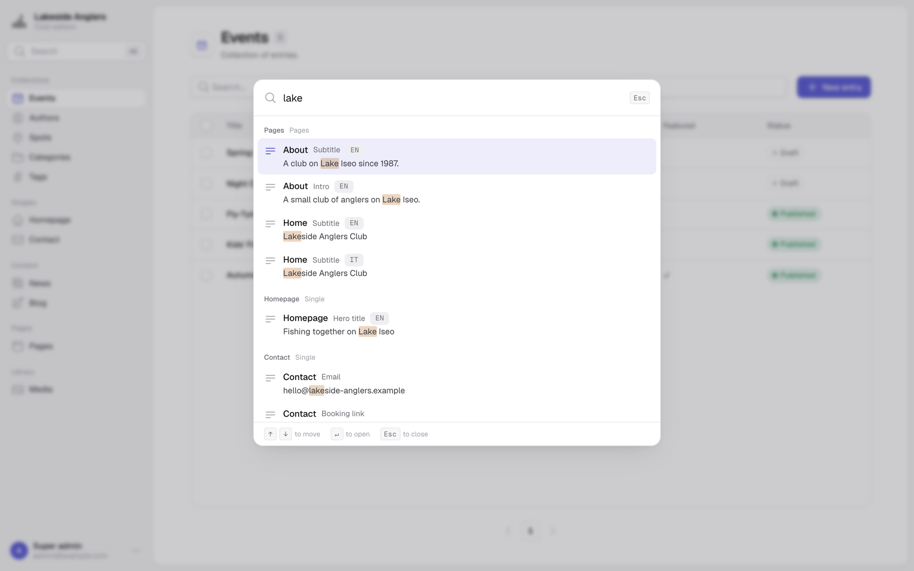

# nuxt-cms

[](https://www.npmjs.com/package/@xleddyl/nuxt-cms)
[](https://github.com/xleddyl/nuxt-cms/actions/workflows/ci.yml)
[](LICENSE)

nuxt-cms is a Nuxt module that adds a CMS to your Nuxt app. The CMS runs in the Nitro server of the app. You deploy one app, with no external CMS service.



## Features

- **Content types in code.** You declare collections, singles, pages and content types (news, blog) in `cms.config.ts`. The module generates the database schema, the migrations and the TypeScript types.
- **Admin panel at `/cms`.** Editors manage entries, drafts and media. The panel has a light and a dark theme, a global search (⌘K) and admin accounts.
- **Visual editor.** Editors build content from your own site components, on a live preview of the site.
- **GraphQL API.** A read-only, typed API with filters, sorting and pagination. Composables such as `useCmsCollection` and `useCmsContent` query it for you.
- **Your database.** SQLite (default), Postgres, libSQL/Turso or Cloudflare D1.
- **Your storage.** S3-compatible storage, a folder on the server disk, or your `public/` folder.
- **Serverless ready.** The build puts the migrations in the server bundle. Uploads go directly to the bucket. Sessions are sealed cookies.

## Screenshots

| Collection | Entry editor |
| --- | --- |
|  |  |
| **Media library** | **Search** |
|  |  |

## Quick start

1. Install the module:

   ```bash
   npm install @xleddyl/nuxt-cms
   ```

2. Add the module to `nuxt.config.ts`:

   ```ts
   export default defineNuxtConfig({
      modules: ['@xleddyl/nuxt-cms'],
   })
   ```

3. Declare your content types in `cms.config.ts`, at the project root:

   ```ts
   import { defineCmsConfig } from '#nuxt-cms'

   export default defineCmsConfig({
      events: {
         id: 'events',
         label: 'Events',
         kind: 'collection',
         titleField: 'title',
         fields: {
            title: { label: 'Title', type: 'text', required: true },
            date: { label: 'Date', type: 'date' },
            poster: { label: 'Poster', type: 'media', mediaType: 'image' },
         },
      },
   })
   ```

4. Set the admin credentials in `.env`:

   ```bash
   NUXT_CMS_ADMIN_EMAIL=admin@example.com
   NUXT_CMS_ADMIN_PASSWORD=change-me
   NUXT_SESSION_PASSWORD=a-random-secret-of-at-least-32-characters
   ```

5. Start the app with `npm run dev`. Open `http://localhost:3000/cms` and sign in.

6. Read the content in a page:

   ```vue
   <script setup lang="ts">
   const { data: events } = await useCmsCollection('events', { sort: [{ field: 'date' }] })
   </script>
   ```

The database is a local SQLite file (`data/cms.db`) by default. To use a different database or media storage, see [Configuration](docs/configuration.md).

## Documentation

| Page | Content |
| --- | --- |
| [Getting started](docs/getting-started.md) | Install, configure, first content type, run |
| [Configuration](docs/configuration.md) | Every `cms.*` option and every env var |
| [Database](docs/database.md) | Drivers, migrations, Drizzle Studio |
| [Schema](docs/schema.md) | Entry kinds, field types, relations, blocks, i18n, form layout |
| [Querying content](docs/querying.md) | GraphQL API, composables, `<CmsBlocks>` |
| [Admin panel & security](docs/admin.md) | Admin pages, search, visual editor, accounts, sessions |
| [Media](docs/media.md) | Storage modes, uploads, allowed file types |
| [Deployment](docs/deployment.md) | Hosts, migrations on serverless, scaling |

[llm.txt](llm.txt) is a compact reference for LLMs: schema, composables and GraphQL API.

## Development

```bash
pnpm install
pnpm dev:prepare   # first time, and after a change to src/module.ts
pnpm dev           # playground on http://localhost:3000
pnpm test
```

The playground (`playground/`) uses every option of the module. Copy `playground/.env.example` to `playground/.env` before the first start.

## License

[MIT](LICENSE)
